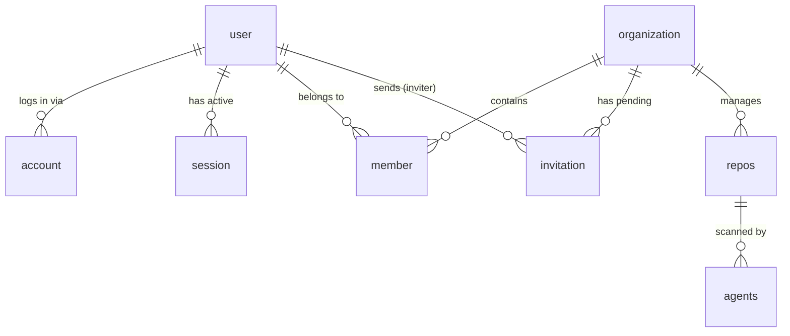

# 🏗️ Agenrix Architecture: The Developer & Tutor Guide

Welcome to the **Agenrix** codebase! This document is designed for someone who is seeing this project for the first time. We will walk through the structure, the technology choices, and the "why" behind our architectural decisions.

---

## 🌟 The Monorepo Concept
Agenrix is a **Monorepo**. Instead of having separate repositories for the frontend, backend, and database logic, we keep everything in one place.
- **`apps/`**: Contains the actual running applications (the UI, the API, the background workers).
- **`packages/`**: Contains shared code (libraries) used by multiple apps. Think of these as internal npm packages.

---

## 🗺️ Technology Map

| Area | Technology | Purpose |
| :--- | :--- | :--- |
| **Runtime** | [Bun](https://bun.sh/) | An ultra-fast JavaScript runtime and package manager. |
| **API** | [Hono](https://hono.dev/) | A small, fast, and battery-included web framework for the API. |
| **Frontend** | [React](https://react.dev/) + [Vite](https://vitejs.dev/) | The industry standard for building interactive user interfaces. |
| **Database** | [PostgreSQL](https://www.postgresql.org/) | Our reliable "Source of Truth" for all user and app data. |
| **ORM** | [Drizzle ORM](https://orm.drizzle.team/) | A "TypeScript-first" way to talk to our database with zero overhead. |
| **Background Jobs** | [Inngest](https://www.inngest.com/) | Handles tasks that take a long time (like AI analysis) without slowing down the API. |
| **Styling** | [Tailwind CSS](https://tailwindcss.com/) | A utility-first CSS framework for rapid UI development. |

---

## 📂 Project Structure In-Depth

### 🧠 1. API Service (`apps/api`)
This is the central "Brain" of Agenrix. It handles requests from the frontend, talks to the database, and coordinates everything.
- **`src/cmd/http/`**: The "Command" center for our web server.
    - `server.ts`: Configures the server, adds security layers (CORS), and sets up logging.
    - `router.ts`: The "Receptionist" that sends incoming requests to the right feature folder.
    - `routes/`: Contains actual endpoints (e.g., `/authentication`, `/user`).
- **`src/infrastructure/`**: The "Plumbing."
    - `ioc/`: (Inversion of Control) We use **InversifyJS** here. Instead of manually creating objects, we "inject" them. This makes the code much easier to test.
    - `persistence/`: Contains the logic for saving data. Our `PostgresPersistence` lives here.
- **`src/shared/`**: Code that is used across different parts of the API (types, constants, utility helpers).

### 🖥️ 2. Frontend App (`apps/app`)
The "Face" of the project. This is what the user interacts with.
- **`src/routes/`**: Uses **TanStack Router**. The folder structure here matches the URL in your browser (e.g., `/login` maps to `login.tsx`).
- **`src/screens/`**: The actual "Pages." We separate routing logic from the actual UI components here.
- **`src/components/ui/`**: Low-level building blocks like Buttons and Inputs, mostly generated via **Shadcn UI**.
- **`src/hooks/`**: Custom logic for the UI, like `getSession.hook.ts` which asks the API "Is the user logged in?".

### ⚙️ 3. Background Worker (`apps/worker`)
The "Muscle." When the API has a heavy task (like analyzing a repo), it tells the Worker to do it in the background so the user doesn't have to wait.
- Powered by **Inngest**. It listens for "events" and executes "workflows" in response.

### 📦 4. Shared Packages (`packages/`)
- **`@agenrix/pg`**: The database source of truth. All our table schemas (User, Session, Account) are defined here once and shared everywhere.
- **`@agenrix/logger`**: A centralized **Pino** logger so that all apps print logs in the same format.
- **`@agenrix/authentication`**: Shared auth logic and frontend React hooks.

## 🗄️ Database Schema & Tables

Our database (PostgreSQL) is managed via **Drizzle ORM** in `packages/pg`. The tables are designed for a multi-tenant application with a robust authentication layer.

### 1. Authentication Tables (Core)
These tables handle identity and access. Even though we currently only use GitHub login, the `account` table is kept for future-proofing and to allow linking multiple login methods (like Google or Email) to a single user in the future.

| Table | Purpose |
| :--- | :--- |
| **`user`** | The central identity. Stores name, email, and profile image. |
| **`account`** | Links an internal `user` to an external provider (GitHub). Stores the GitHub ID and Access Token. |
| **`session`** | Tracks active logins. Stores a UUID `token` that is sent to the browser as a cookie. |
| **`verification`** | Used for temporary security tokens (like email verification or password resets). |

### 2. Organization & Multi-tenancy
These tables allow users to collaborate in shared workspaces.

| Table | Purpose |
| :--- | :--- |
| **`organization`** | Represents a team or workspace. It has a `name` and a unique `slug`. |
| **`member`** | Links a `user` to an `organization`. It stores the user's `role` (e.g., "admin", "member"). |
| **`invitation`** | Stores pending requests sent to people to join an organization. |

### 3. Application Data (Repo-Scanner)
These tables store the actual work data of the Agenrix platform.

| Table | Purpose |
| :--- | :--- |
| **`repos`** | Stores metadata about the repositories being scanned (ID, name, link, classification). |
| **`agents`** | Represents the AI agents or automated workers assigned to repository analysis tasks. |

### 🔗 Table Relationships



---

## 🔐 Authentication Evolution

We are currently in a transition phase between two authentication strategies:

### Path A: Better-Auth (Legacy)
Originally, we used **Better-Auth**, a comprehensive framework that handles sessions and OAuth.
- **Flow**: Frontend calls a Better-Auth endpoint -> Better-Auth handles the redirect to GitHub -> Better-Auth saves the session.
- **The Problem**: Because it is a heavy framework, it was causing high latency (>5s) on some database lookups.
- **Files**: `infrastructure/config/better-auth.config.ts`, `lib/auth/client.ts`.

### Path B: Direct Drizzle Auth (Modern & Fast)
To fix the performance issues, we built a custom, lightweight auth flow using **Drizzle ORM** directly. This reduced response times from 5s to under 500ms.
- **Flow**: 
    1. **Sign-In**: Frontend redirects user to `/v1/authentication/sign-in/github`.
    2. **Callback**: GitHub sends the user back to our API.
    3. **Processing**: We manually exchange the code for a token, fetch the user profile, and use Drizzle to `upsert` (Update or Insert) the user in our DB.
    4. **Session**: we generate a UUID session token, save it to the `session` table, and set it as an `httpOnly` cookie.
- **Files**: `apps/api/src/cmd/http/routes/authentication/auth.route.ts`.

---

## 🛠️ Implementation Deep Dive: Custom Supabase/Drizzle Auth

This section explains exactly how we implemented a custom authentication system using **Drizzle ORM** and **Supabase (PostgreSQL)**, replacing the legacy Better-Auth system for better performance.

### 📁 Folder 1: `packages/pg` (The Database Blueprint)
Everything starts with the schema. We defined the tables in TypeScript using Drizzle.
- **`src/schema/user.schema.ts`**: Stores basic profile information.
- **`src/schema/account.schema.ts`**: Connects a User to a Provider (like GitHub) and stores OAuth tokens.
- **`src/schema/session.schema.ts`**: Stores the random UUID tokens we send to the user's browser.

### 📁 Folder 2: `apps/api/src/cmd/http/routes/authentication` (The Logic)
This is where the actual "work" happens in `auth.route.ts`.

#### Step 1: The Redirect
When you click "Login", we build a URL and send you to GitHub.
```typescript
const url = `https://github.com/login/oauth/authorize?client_id=${clientId}&redirect_uri=${redirectUri}&scope=${scopes}`;
return ctx.redirect(url);
```

#### Step 2: The Callback & Profile Fetch
GitHub sends you back with a `code`. We exchange it for an `accessToken`, then fetch your profile and email.
```typescript
const userResponse = await fetch("https://api.github.com/user", {
  headers: { Authorization: `Bearer ${accessToken}`, "User-Agent": "Agenrix-Auth" },
});
const githubUser = await userResponse.json();
```

#### Step 3: The "Upsert" (Find or Create)
We check if you already exist. If not, we create a new `user` and a new `account` record in Supabase.
```typescript
const existingAccount = await db.select().from(accountSchema)
  .where(and(eq(accountSchema.providerId, "github"), eq(accountSchema.accountId, String(githubUser.id))))
  .limit(1).then(res => res[0]);
```

#### Step 4: Session Creation
We generate a unique `sessionToken` (UUID), save it to the `session` table, and set it as an `httpOnly` cookie.
```typescript
setCookie(ctx, "session_token", sessionToken, {
  path: "/",
  httpOnly: true,
  sameSite: "lax",
  secure: env.nodeEnv === "production",
  expires: expiresAt,
});
```

### 📁 Folder 3: `apps/api/src/cmd/http/middlewares` (The Gatekeeper)
In `authentication.middleware.ts`, we intercept every incoming request to check if the user is logged in.

```typescript
const token = getCookie(ctx, "session_token");
const result = await db.select().from(sessionSchema)
  .innerJoin(userSchema, eq(sessionSchema.userId, userSchema.id))
  .where(eq(sessionSchema.token, token)).limit(1).then(res => res[0]);

if (result) {
  ctx.set("authentication", { user: result.user, session: result.session });
}
```

### 📁 Folder 4: `apps/app/src/screens/auth` (The Trigger)
The frontend simply navigates to the API's sign-in route.
```typescript
// apps/app/src/screens/auth/login.screen.tsx
window.location.href = `${env.VITE_API_URL}/v1/authentication/sign-in/github`;
```

---

## 🛠️ Legacy Implementation: Better-Auth

Before moving to our custom Drizzle auth, we used **Better-Auth**. It is important to understand this setup as some parts of the codebase still reference its data structures.

### 📁 Folder 1: `apps/api/src/infrastructure/config` (The Config)
Better-Auth was configured in `better-auth.config.ts`. It acted as a "Black Box" that handled all auth logic automatically.
- **Key Feature**: The `adapter` linked Better-Auth directly to our Postgres database.
- **Social Login**: GitHub was configured inside the `socialProviders` object.

```typescript
export const authentication = createAuthenticationServerClient({
  database: postgres, // Direct link to DB
  socialProviders: {
    github: {
      clientId: env.oauth.github.clientId,
      clientSecret: env.oauth.github.clientSecret,
    },
  },
});
```

### 📁 Folder 2: `apps/api/src/cmd/http` (The Wildcard Route)
Better-Auth requires a "Catch-all" route. In `server.ts`, we mounted it so that any request starting with `/v1/authentication/*` would be handled by the library.

```typescript
// Legacy server.ts logic
this.app.on(["POST", "GET"], "/v1/authentication/*", (ctx) => {
  return authentication.handler(ctx.req.raw);
});
```

### 📁 Folder 3: `apps/app/src/lib/auth` (The Client)
On the frontend, we used `client.ts` to create an `authClient`. This client automatically knew how to talk to the backend catch-all route.

```typescript
// apps/app/src/lib/auth/client.ts
export const authClient = createAuthClient({
  baseURL: import.meta.env.VITE_API_URL,
});
```

### 📁 Folder 4: `apps/app/src/hooks` (The Hooks)
The frontend would use hooks like `authClient.useSession()` to check if a user was logged in. This was easy to use but caused the performance bottlenecks (high latency) that led us to build the custom solution.

---

## 🔄 Core Process Flows
... (existing Mermaid diagrams) ...

---

## 💡 Pro Tips for Tutors
- **Environment Variables**: Always check `.env` files in `apps/api` and `apps/app`. They are the "Settings" for the entire engine.
- **Database Migrations**: If you change a file in `packages/pg/src/schema`, you must run `bun run generate` inside that folder to update the database "blueprint."
- **Hot Reloading**: Bun is very fast, but if you change code in `packages/`, you might need to restart your `bun run dev` command to see the changes.

